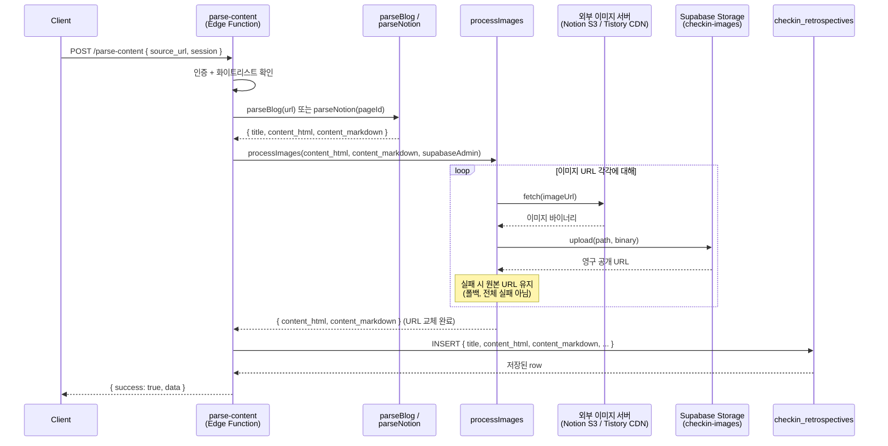

# 0001 - 파싱 시점에 이미지를 Supabase Storage에 저장

- 상태: 승인됨
- 날짜: 2026-03-06
- 관련 이슈: #4 (블로그 글 이미지 깨짐), #6 (파서 이슈 개선)

## 컨텍스트

블로그(티스토리) 및 노션 페이지를 파싱할 때 이미지 URL을 원본 그대로 DB에 저장하고 있다.
이 URL들은 시간이 지나면 사용할 수 없게 된다:

- **노션**: 비공식 API가 반환하는 이미지 URL은 AWS S3 signed URL로, 수 시간 내에 만료된다.
- **티스토리 / 일반 블로그**: CDN 정책·블로그 이전·글 삭제 등으로 언제든 링크가 깨질 수 있다.

파싱 결과(`content_html`, `content_markdown`)에 삽입된 이미지 URL이 깨지면 앱 내에서 글을 읽을 수 없게 된다.

## 결정

**파싱 직후, DB INSERT 전에 이미지를 Supabase Storage로 옮긴다.**

- 새 파일 `image-processor.ts`를 `parse-content` Edge Function 안에 추가한다.
- `processImages(html, markdown, supabaseAdmin)` 함수가 콘텐츠에서 이미지 URL을 추출하고, 다운로드 후 `checkin-images` 버킷에 업로드한다.
- 업로드된 영구 URL로 `content_html` / `content_markdown` 안의 원본 URL을 교체한 뒤 DB에 INSERT한다.
- 이미지 한 건 실패 시 원본 URL을 유지하고 전체 파싱을 실패시키지 않는다.

## 검토한 대안

### 대안 A: 별도 `process-images` Edge Function (비동기)

INSERT 후 별도 함수를 비동기로 호출하여 이미지를 처리하고 DB를 UPDATE한다.

- **장점**: 사용자 응답이 빠르다.
- **단점**: 처리 완료 전까지 이미지가 깨진 상태로 보인다. 프론트엔드에서 처리 상태를 폴링하거나 표시해야 하는 복잡도가 생긴다.

### 대안 B: DB 트리거 + pg_net

INSERT 트리거로 pg_net이 백그라운드에서 처리 함수를 호출한다.

- **장점**: 가장 비동기적이고 견고하다.
- **단점**: 이 앱의 규모(팀 내부 도구)에 비해 오버엔지니어링이다. 디버깅이 어렵다.

### 대안 C: 렌더 타임 프록시

이미지를 저장하지 않고 읽을 때마다 프록시 서버를 경유한다.

- **단점**: 원본이 완전히 사라지면 프록시도 소용없다. 매 렌더마다 외부 의존성이 생긴다.

## 결정 이유

이 앱의 규모에서는 구조 단순성이 가장 중요하다.
블로그 포스트 이미지는 평균 5~15장이며, 이미지당 업로드 ~1초를 가정하면 5~15초 내에 처리 가능하다.
Supabase Edge Function의 최대 실행 시간은 400초이므로 타임아웃 위험은 낮다.
이 방식은 현재 `parse-content` 함수에서 완결되며 추가 인프라가 필요 없다.

## 구체적 흐름

## 구현 세부 사항

- **버킷**: `checkin-images` (public 읽기, 인증된 업로드)
- **저장 경로**: `images/{user_id}/{timestamp}-{hash}.{ext}`
  - user_id: 소유자 추적
  - timestamp + content hash: 중복 방지 및 캐시 안전성
- **URL 추출 대상**:
  - `content_html`: `` 속성
  - `content_markdown`: `` 패턴
- **중복 처리**: 동일 URL이 여러 번 등장하면 한 번만 업로드하고 Map으로 교체
- **마이그레이션**: `checkin-images` 버킷 생성 SQL 마이그레이션 추가 필요

## 결과

- 앱 내 이미지가 영구적으로 표시된다.
- 원본 사이트가 사라지거나 URL이 만료되어도 이미지가 유지된다.
- 파싱 응답 시간이 이미지 수에 비례하여 늘어날 수 있으나, 현재 규모에서 허용 가능한 수준이다.
