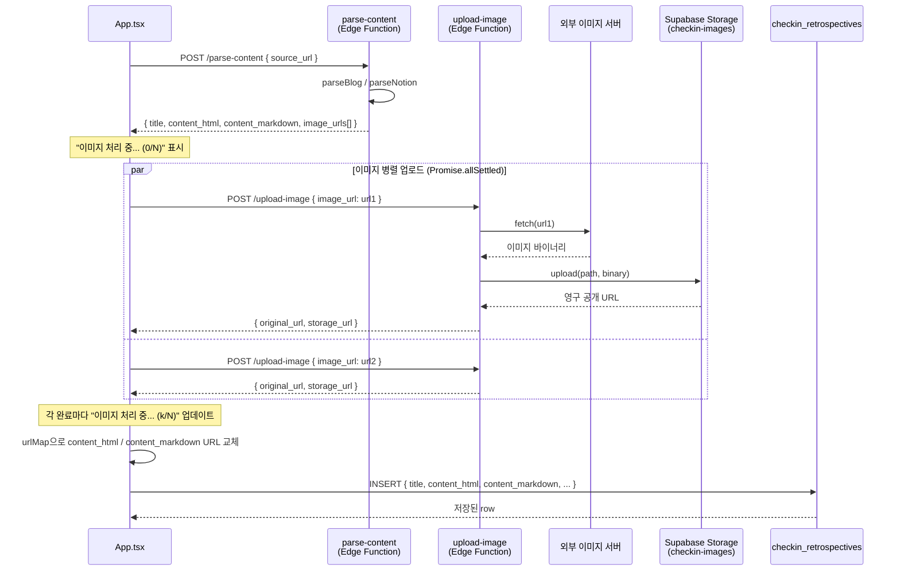
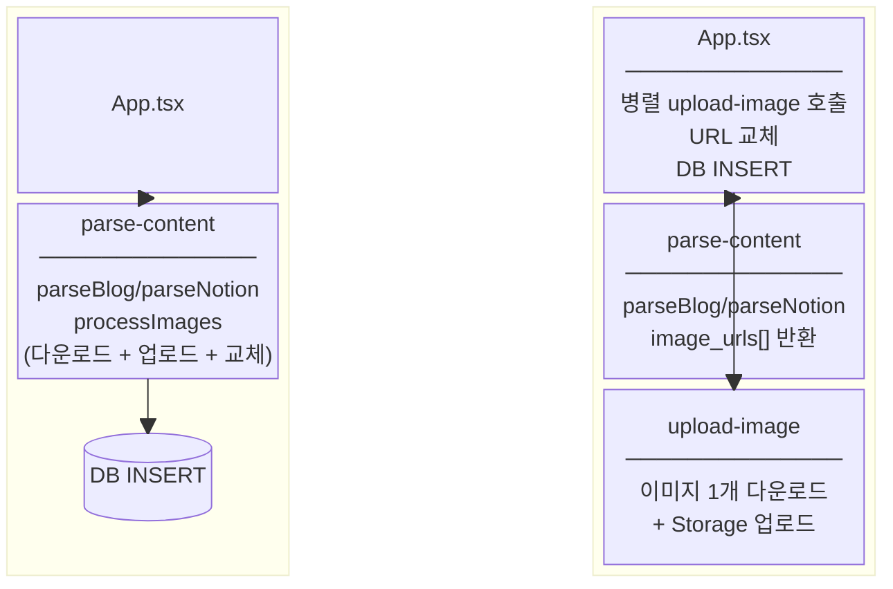

# 0002 - 이미지 업로드를 별도 Edge Function으로 분리

- 상태: 승인됨
- 날짜: 2026-03-23
- 관련 커밋: c959c89
- 이전 결정: [0001 - 파싱 시점에 이미지를 Supabase Storage에 저장](0001-image-storage-on-parse.md)

## 컨텍스트

[0001](0001-image-storage-on-parse.md)에서 `parse-content` Edge Function 내부의 `processImages`가 이미지를 다운로드·업로드·URL 교체까지 모두 처리하도록 결정했다.

이 구조에서 두 가지 문제가 드러났다.

1. **타임아웃 위험**: 이미지가 많은 글(노션 등)은 `parse-content` 단일 함수 안에서 직렬로 처리하므로 실행 시간이 길어진다. 이론적으로 400초 이내이지만, 외부 이미지 서버 응답이 느릴 경우 실질적으로 함수 전체가 블로킹된다. (Supabase Edge Function의 무료 버전 제한)
2. **로딩 피드백 부재**: 클라이언트는 `parse-content`가 완료될 때까지 진행 상황을 알 수 없다. 이미지가 10장이면 사용자에게는 그냥 "멈춘 것처럼" 보인다.

## 결정

**이미지 업로드를 `upload-image` Edge Function으로 분리하고, 병렬 처리와 진행 상태 표시는 클라이언트(App.tsx)가 담당한다.**

- `parse-content`는 `processImages` 호출을 제거하고, 파싱된 이미지 URL 목록(`image_urls: string[]`)만 반환한다.
- 새 `upload-image` Edge Function은 이미지 URL 1개를 받아 Storage에 업로드한 뒤 `{ original_url, storage_url }`을 반환한다.
- `App.tsx`의 `handleAddArticle`이 `Promise.allSettled`로 이미지들을 병렬 호출하고, 결과 Map으로 HTML/Markdown의 URL을 교체한 뒤 DB에 INSERT한다.
- `AddArticleModal`은 `setStatus` 콜백을 통해 "파싱 중..." → "이미지 처리 중... (N/M)" 단계별 텍스트를 표시한다.

## 검토한 대안

### 대안 A: parse-content 내부 병렬 처리 유지

`processImages` 안에서 `Promise.allSettled`로 병렬화한다.

- **장점**: 구조 변경 없이 속도 개선 가능.
- **단점**: 진행 상황을 클라이언트에 스트리밍하려면 SSE나 WebSocket이 필요하다. Supabase Edge Function에서 SSE는 구현 복잡도가 높다. 단일 함수 타임아웃 문제도 근본적으로 해결되지 않는다.

### 대안 B: 이미지 처리 비동기화 (INSERT 후 백그라운드)

DB INSERT를 먼저 하고 이미지 처리는 백그라운드에서 진행한다 (0001의 "대안 A"와 동일).

- **단점**: 처리 완료 전에는 이미지가 깨진 상태로 보인다. 폴링 또는 Realtime 구독이 필요하다.

### 대안 C: Supabase 유료 플랜 전환

Pro 플랜으로 업그레이드하면 Edge Function CPU 시간·메모리 제한이 완화되어, 0001의 `parse-content` 단일 함수 구조를 그대로 유지할 수 있다.

- **장점**: 코드 변경 없이 타임아웃 문제가 해소된다.
- **단점**: 이 앱은 팀 내부 도구로, 비용 지출을 정당화할 트래픽이 없다. 유료 전환으로 로딩 피드백 부재 문제는 해결되지 않는다.

## 결정 이유

클라이언트가 각 이미지 업로드를 개별 요청으로 병렬 호출하면 두 문제가 동시에 해결된다.

- **타임아웃 위험 제거**: Edge Function 1개의 부하가 "이미지 URL 1개 다운로드 + 업로드"로 고정된다.
- **진행 피드백**: `Promise.allSettled` 내부에서 각 요청이 완료될 때마다 카운터를 증가시키고 `setStatus`로 UI를 업데이트한다. 별도 스트리밍 인프라 없이 구현된다.
- **실패 격리**: 이미지 1개 실패가 전체 글 추가를 막지 않는다 (`allSettled` 사용). 업로드 실패 이미지는 원본 URL이 유지된다.

규모 대비 복잡도가 낮고, 클라이언트가 이미 보유한 세션 토큰으로 직접 호출하므로 서버 간 인증 구성도 필요 없다.

## 구체적 흐름

## 구현 세부 사항

- **`upload-image` 함수**: `verify_jwt = false` (클라이언트가 anon key + Authorization 헤더로 직접 호출)
- **저장 경로**: `images/{user_id}/{timestamp}-{sha256(url)}.{ext}` — 0001과 동일한 규칙 유지
- **URL 교체**: `content_html`은 `src="..."`, `content_markdown`은 `](...)` 패턴을 `replaceAll`로 교체
- **실패 처리**: `allSettled` 결과 중 `fulfilled`이고 `storage_url`이 있는 것만 urlMap에 추가, 나머지는 원본 URL 유지

## 0001과의 관계

0001의 핵심 결정("파싱 직후, DB INSERT 전에 이미지를 Storage로 옮긴다")은 유지된다.
변경된 것은 **어디서(where)** 옮기느냐이다: Edge Function 내부 → 클라이언트 주도 병렬 호출.
0001에서 검토했던 "대안 A (별도 함수 비동기)"와 유사하지만, 비동기(INSERT 후)가 아니라 **INSERT 전 동기 병렬**이므로 이미지가 깨진 상태로 저장되지 않는다.

## 결과

- 이미지 처리 중 사용자에게 단계별 진행 상태가 표시된다.
- 단일 Edge Function 타임아웃 위험이 제거된다.
- 글 추가 전체 흐름의 실패 격리가 개선된다.
