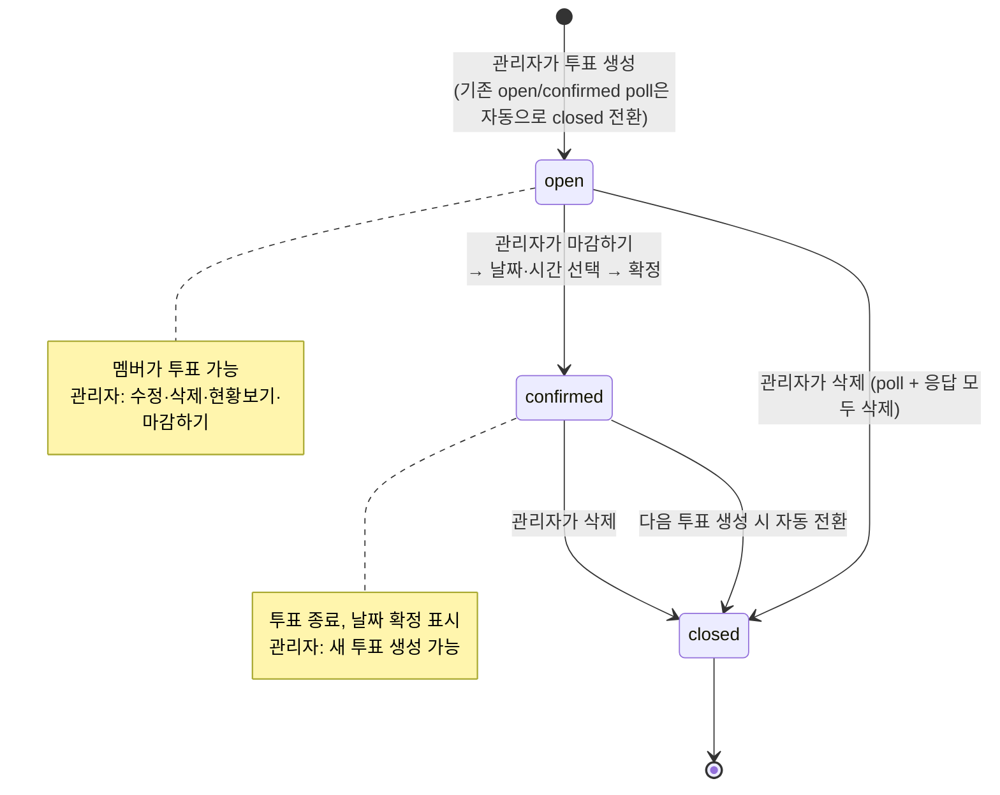
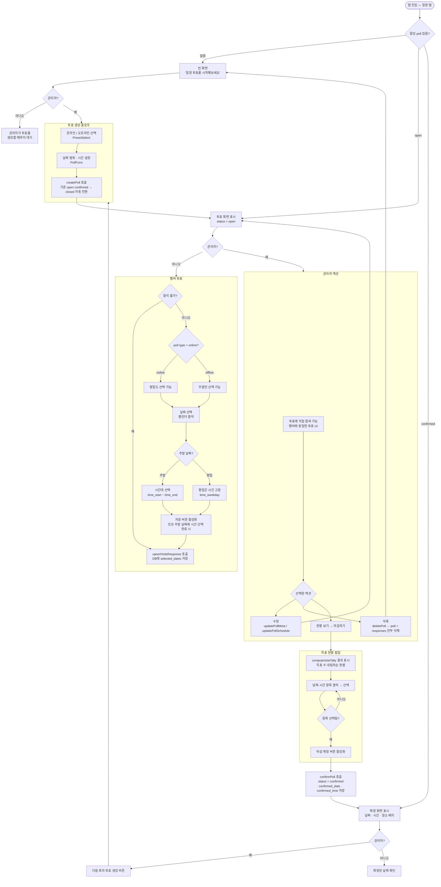
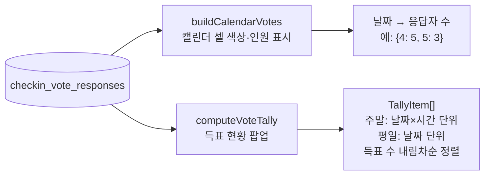
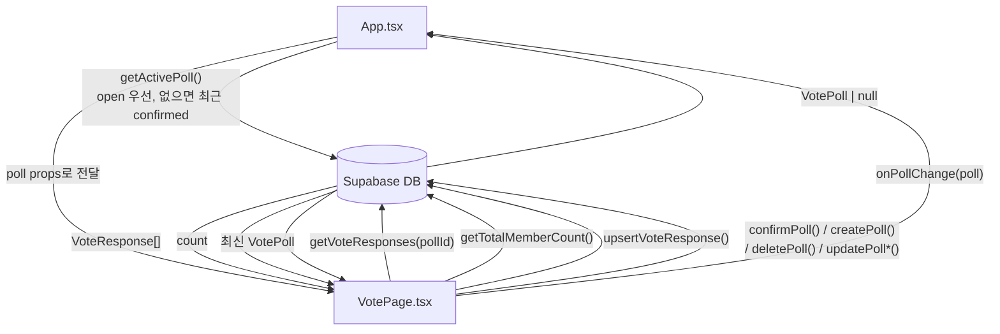

# 일정 투표 시스템 플로우

checkin 앱의 일정 탭(`VotePage`) 전체 흐름을 정리한 문서.

---

## 1. Poll 상태 다이어그램

Poll(`checkin_vote_polls`)이 어떤 상태를 가지고, 언제 전이하는지.

> **`getActivePoll()` 우선순위**: open poll → (없으면) 가장 최근 confirmed poll.
> closed poll은 목록에 노출되지 않는다.

---

## 2. 전체 사용자 플로우 (관리자 / 멤버)

관리자와 일반 멤버의 행동 흐름을 swimlane으로 분리.

---

## 3. Poll 타입별 투표 규칙

|                | offline                                    | online                            |
| -------------- | ------------------------------------------ | --------------------------------- |
| 선택 가능 날짜 | **주말만**                                 | 모든 날짜                         |
| 평일 시간      | 해당 없음                                  | `time_weekday`로 고정 (선택 불가) |
| 주말 시간      | `time_start`~`time_end` 범위에서 복수 선택 | 동일                              |

---

## 4. 집계 로직 두 종류

VotePage에는 목적이 다른 두 가지 집계가 존재한다. 혼동 주의.

> **왜 숫자가 다른가?**
> 캘린더의 "4일 5명"은 "4일을 하루라도 선택한 사람" 수.
> 득표 현황의 "4일 20:00 4명"은 "4일 20시를 선택한 사람" 수.
> 동일 날짜라도 시간대마다 선택자가 다르므로 두 값이 다른 것은 정상 동작.

---

## 5. 데이터 흐름 (컴포넌트)

> `App.tsx`는 `activePoll`만 fetch. `responses`와 `totalMembers`는 VotePage 내부에서 직접 fetch.
> Poll을 변경하는 모든 작업(생성·확정·삭제·수정) 후에는 `onPollChange()`로 App 상태를 동기화한다.
